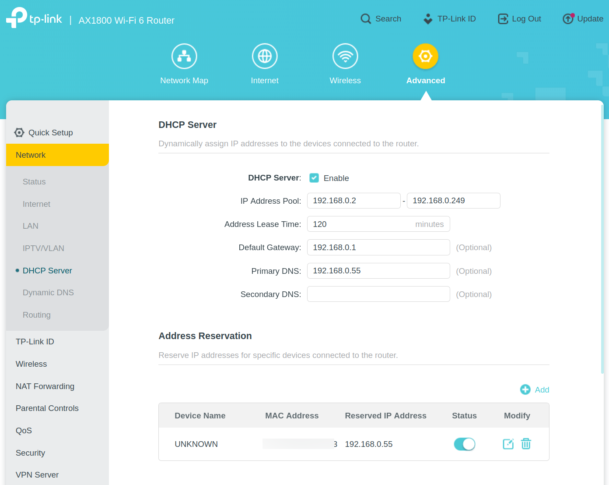

# Pihole-home-network-project
## Pi-hole Home Network Ad Blocking Project
### Overview

This project sets up and configures Pi-hole on a Raspberry Pi to provide network-wide ad blocking and DNS filtering. The Raspberry Pi is assigned a static IP address and configured so that the home router uses it as the primary DNS server.

### Hardware Used
- Raspberry Pi 5 (8GB)
- Official Raspberry Pi OS (Bookworm, 64-bit)
- Ethernet connection to home network

### Key Steps Completed

1. Perform initial Raspberry Pi setup and set a user account.
2. Enable SSH, either during imaging or using ```sudo raspi-config``` from a terminal.
3. Update the system: <br>```sudo apt update && sudo apt upgrade -y```
4. Install Pi-hole using the official script: <br>```curl -sSL https://install.pi-hole.net | bash```
5. Assign a static IP address via the router's DHCP reservation settings:
   - Log in to the router's admin settings page.
   - Find the Pi under connected devices.
   - Reserve its LAN IP (to ensure its address remains consistent without configuring it on the Pi)
6. In the router DNS settings, set Primary DNS to the Pi-hole IP.

## Screenshots

### Pi-hole Dashboard


### Router DHCP Reservation

*(MAC addresses redacted for privacy)*


### Verifying Pi-hole DNS Blocking


  
## Result

All devices on the home network now use DNS-level ad and tracking blocking. Additional device-level blockers (like uBlock Origin) can enhance results.

## Future Improvements

- Use Docker to host multiple services alongside Pi-hole
- Add Unbound for local recursive DNS to keep network independent of 3rd-party DNS providers
- Integrate VPN access for remote management

## NOTES

- DHCP reservation on the router ensures that the Pi keeps a consistent IP address without manual static configuration on th Pi itself.
- Pi-hole cannot block YouTube or in-app ads from Facebook, Instagram, etc. reliably due to how those apps serve content.
